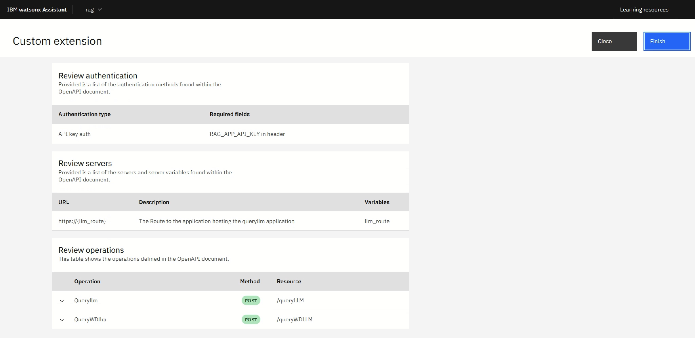
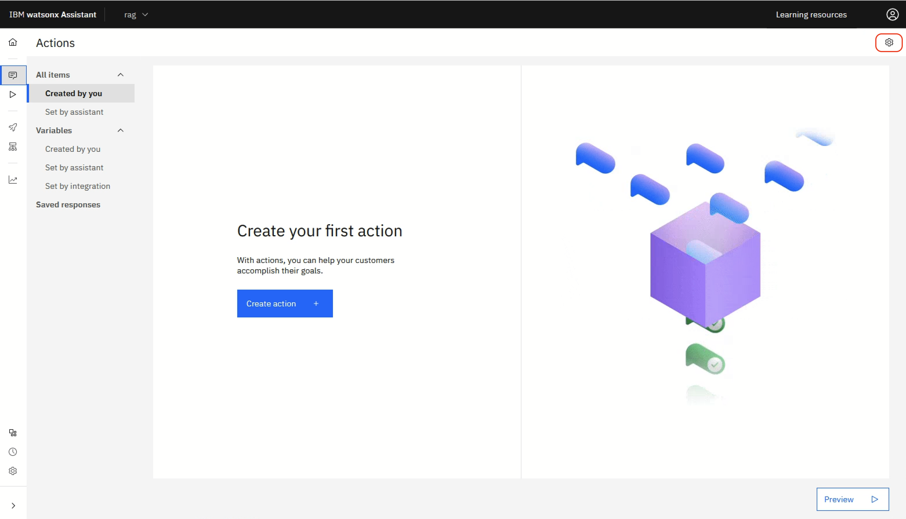

# Installing Retrieval Augmented Generation (RAG) application using watsonx.ai and watsonx.Discovery

This tutorial lists the steps to setup RAG with watsonx.ai, watsonx Discovery, and watsonx Assistant

## Prerequisites

1. An existing OpenShift cluster with file and block storage and the compute required for IBM Cloud Pak for Data, OpenShift Data Foundation (ODF), and watsonx.ai. 
2. Foundation model *llama-2-13b-chat* and/or *granite-13b-chat-v2* deployed in watsonx.ai.
3. A Linux VM with the following:
   1. oc CLI command
   2. cpd-cli CLI command
   3. python 3.10

## Installation

### watsonx Discovery Installation

#### Deploy Elasticsearch

1. On your Linux VM, download from the github repo *watsonxDiscovery.zip* that contains three files: elastic.yaml, enterprise-search.yaml, and kibana.yaml.

   ```shell
   unzip watsonxDiscovery.zip
   ```

2. Create the Elasticsearch CRDs

   ```shell
   oc apply -f https://download.elastic.co/downloads/eck/2.11.1/crds.yaml
   ```

3. Create the Elasticsearch operator

   ```shell
   oc apply -f https://download.elastic.co/downloads/eck/2.11.1/operator.yaml
   ```

4. Create the Elasticsearch project

   ```shell
   oc new-project elastic
   ```

5. Create an instance of Elasticsearch

   ```shell
   oc apply -f elastic.yaml
   ```

   IMPORTANT: The elastic-search image/container requires a minimum of 8Gi of memory to function properly, and this may not be applied by default. Use the provided elastic.yaml file to set the containers memory limits to the 8Gi minimum requirement.

6. Validate successful creation of the Elastic Search Instance

   ```shell
   oc get pods -l common.k8s.elastic.co/type=elasticsearch -n elastic -w
   ```

   Wait about one minute for the pod labeled "common.k8s.elastic.co/type=elasticsearch" to enter a ready and running state.

#### Deploy Enterprise Search

1. Create an instance of Enterprise Search

   ```shell
   oc apply -f enterprise-search.yaml
   ```

2. Validate successful creation of the Enterprise Search Instance

   ```shell
   oc get pods -l common.k8s.elastic.co/type=enterprise-search -n elastic -w
   ```

   Wait about three minutes for the pod labeled "common.k8s.elastic.co/type=enterprise-search" to enter a ready and running state.

#### Deploy Kibana

1. Create an instance of Kibana UI

   ```shell
   oc apply -f kibana.yaml
   ```

2. Validate successful creation of the Kibana UI Instance

   ```shell
   oc get pods -l common.k8s.elastic.co/type=kibana -n elastic -w
   ```

   Wait about one minute for the pod labeled "common.k8s.elastic.co/type=kibana" to enter a ready and running state.

#### Access the Kibana UI

1. Retrieve the generated admin password

   ```shell
   oc get secret elastic-search-es-elastic-user -n elastic -o jsonpath="{.data.elastic}" | \
    base64 --decode
   ```

2. Retrieve the Kibana route from OpenShift

   ```shell
   oc get route kibana -n elastic
   ```

3. Login to Kibana UI using default user 'elastic'. Save the user credential to be used later for document ingestion.

   

#### Apply the Elasticsearch Trial License

1. Open the following URL using the Kibana host retrived in the last step to access the Dev Tools application

   ```shell
   https://<kibana-host>/app/dev_tools#/console
   ```

2. Run the following API's to check the license status and activate the 30-day trial license:

   ```shell
   GET /_license/trial_status
   
   GET /_license
   
   POST /_license/start_trial?acknowledge=true
   
    Verify output (GET /_license)
   
   {
     "license": 
     {
       "status": "active",
       "uid": "a4e797e5-c4f5-4365-72-c9b7c82aad9c",
       "type": "trial",
       "issue_date": "2024-03-11T14:42:54.477Z",
       "issue_date_in_millis": 1710168174477,
       "expiry_date": "2024-04-10T14:42:54.477Z",
       "expiry_date_in_millis": 1712760174477,
       "max_nodes": 1000,
       "max_resource_units": null,
       "issued_to": "elastic-search",
       "issuer": "elasticsearch",
       "start_date_in_millis": -1
     }
   }
   ```

#### Deploy the .elser_model_2 ML Model

1. Go to ***Machine Learning->Trained Models*** and download *.elser_model_2* in the Elasticsearch UI. Select ***Deploy*** to start the deployment of the model.

   

#### Ingest documents

1. Download the watsonx Discovery tool to ingest documents

   ```shell
   git clone https://github.com/ibm-build-lab/watsonx-wxd-setup-and-ingestion --branch onprem
   ```

2. Create a Python virtual environment:

   ```shell
   cd watsonx-wxd-setup-and-ingestion/
   python3.10 -m venv .venv
   source .venv/bin/activate
   ```

3. Install dependent modules from requirements.txt:

   ```shell
   pip install --upgrade pip
   pip install -r requirements.txt
   ```

4. Copy all the relevant documents to a folder to be ingested

   ```shell
   mkdir ingested-docs
   cp *.pdf ingested-docs
   ```

5. Configure the environment variables in *.env* to prepare document ingestion into elastic.

   ```shell
   cp elastic/.envExample elastic/.env
   vi elastic/.env
   # Update 3 variables 
      ELASTIC_URL=https://elastic-search-route-elastic.apps.<domain-name>:443
      ELASTIC_USERNAME=elastic
      ELASTIC_PASSWORD=<kibana-password>
   ```

   *ELASTIC_URL*: it can be retrieved by running 
   
   ```shell
   oc -n elastic get route elastic-search-route
   ```
   *ELASTIC_USERNAME*: 'elastic' is the default user.
   *ELASTIC_PASSWORD*: this is kibana login password retrieved in the previous step.
<br>
6. Configure *configs/config.yaml*.
   
   ```shell
   cp configs/sample_config.yaml configs/config.yaml
   vi configs/config.yaml
   # modify the following fields:
      type: "local"
      location: "ingested-docs"
      index_name: "vmware-index"
      pipeline_name: "vmware-pipeline"
   ```

   *type*: choose "local" to ingest from a local directory.
   *location*: directory name that contains the documents to be ingested.
   *index_name*: elastic search index name of your choice. 
   *pipeline_name*: elastic search pipeline name of your choice. 
<br>
7. Ingest the documents into elastic by running ingest.py.

   ```shell
   python3 elastic/ingest.py -c "configs/config.yaml"
   ```

8. Go to Elasticsearch UI ***Menu->Search->Content->Indices*** and verify whether the ingested documents are indexed:

   

### watsonx Assistant Installation

1. Set up Multicloud Object Gateway.

   ```shell
   ./cpd-cli manage setup-mcg --components=watson_assistant \
      --cpd_instance_ns=${PROJECT_CPD_INST_OPERANDS} \
      --noobaa_account_secret=noobaa-admin \
      --noobaa_cert_secret=noobaa-s3-serving-cert
   ```

2. Install serverless knative eventing

   ```shell
   ./cpd-cli manage deploy-knative-eventing --release=${VERSION} \
      --block_storage_class=${STG_CLASS_BLOCK}
   ```

3. Apply OLM

   ```shell
   ./cpd-cli manage apply-olm --release=${VERSION} \
      --cpd_operator_ns=${PROJECT_CPD_INST_OPERATORS} \
      --components=watson_assistant
   ```

4. Apply custom resources

   ```shell
   ./cpd-cli manage apply-cr --components=watson_assistant \
      --release=${VERSION} \
      --cpd_instance_ns=${PROJECT_CPD_INST_OPERANDS} \
      --block_storage_class=${STG_CLASS_BLOCK} \
      --file_storage_class=${STG_CLASS_FILE} \
      --license_acceptance=true
   ```

### RAG LLM Application Setup

#### Enable OpenShift internal image registry
Refer to the IBM docs [Enabling the OpenShift internal image registry by using the existing OpenShift Container Storage](https://www.ibm.com/docs/en/mas-cd/continuous-delivery?topic=installing-enabling-openshift-internal-image-registry#task_lxz_pmb_f5b__title__1) for more information.

1. Create a PVC to provide storage for the image registry

   ```shell
   oc -n openshift-image-registry create -f <(echo '{
      "apiVersion": "v1",
      "kind": "PersistentVolumeClaim",
      "metadata": {
        "name": "image-registry-storage"
      },
      "spec": {
        "storageClassName": "file-sc",
        "accessModes": [ "ReadWriteMany" ],
        "resources": {
          "requests": { "storage": "500Gi"
        }
      }
    }
   }')
   ```

2. Edit the registry Custom Resource (CR) spec with the following command:
   
   ```shell
   oc -n openshift-image-registry edit configs.imageregistry.operator.openshift.io 
   ```

3. Change *spec.managementState* from *Removed* to *Managed*.
<br>

4. Change *spec.storage* from {} to reference the PVC provisioned earlier.

   ```shell
   spec:
       managementState: Managed
   storage:
         pvc:
           claim: image-registry-storage
   ```

5. Check that the image registry is available.

   ```shell
   oc get co image-registry
   ```

6. Enable the external route to the image registry.

   ```shell
    oc -n openshift-image-registry patch configs.imageregistry.operator.openshift.io/cluster --patch '{"spec":{"defaultRoute":true}}' --type=merge
    ```

#### Install the RAG LLM application

1. On your Linux VM, download RAG-LLM-Service from the github repo.

   ```shell
   git clone https://github.com/ibm-build-lab/RAG-LLM-Service/ --branch onprem
   ```

2. Create a Python virtual environment:

   ```shell
   cd RAG-LLM-Service/
   python3.10 -m venv .venv
   source .venv/bin/activate
   ```

3. Install dependent modules from requirements.txt:

   ```shell
   pip install --upgrade pip
   pip install -r requirements.txt
   ```

4. Create a new project

   ```shell
   oc new-project rag
   ```

5. Update *secret.yaml* in the openshift_files directory. Variable sample values are illustrated below:

   ```shell
   apiVersion: v1
   kind: Secret
   metadata:
     name: rag-secret
     namespace: rag
   type: Opaque
   stringData:
     RAG_APP_API_KEY: vmwarekey
     IBM_CLOUD_API_KEY: Vp1WmCuotnOIMMY1PCxd5KeJ2d9KKhqG1dSdvfVl
     WX_URL: https://cpd-cpd-instance-1.app.<domain-name>.com
     WX_PROJECT_ID: c22ee422-4d73-41b9-9ab9-50d609229d92
     WXD_USERNAME: elastic
     WXD_PASSWORD: JsKg79M4oZ7z1712eb6GlSW9
     WXD_URL: https://elastic-search-route-elastic.app.<domain-name>.com/
   ```

   The explanation of each variable is as follows:
   
   *metadata.name*: name of the secret
   *metatdata.namespace*: namespace in which the secret is to be created
   *RAG_APP_API_KEY*: password of your choice to authenticate with the application.
   *IBM_CLOUD_API_KEY*: This is the API key for the *cpadmin* user in IBM Cloud Pak for Data. Its login credential can be retrieved with this command:
   ```shell
   cpd-cli manage get-cpd-instance-details --cpd_instance_ns=${PROJECT_CPD_INST_OPERANDS} --get_admin_initial_credentials=true".
   ```
   Once logged in to the IBM Cloud Pak for Data UI, go to the *cpadmin* user profile and select ***API key->Generate new key*** to retrieve this API key.
   
   

   *WX_URL*: This is the IBM Cloud Pak for Data portal URL. It can be retrieved with this command:
   ```shell
   cpd-cli manage get-cpd-instance-details --cpd_instance_ns=${PROJECT_CPD_INST_OPERANDS} --get_admin_initial_credentials=true".
   ```
   *WX_PROJECT_ID*: A blank project needs to be created for user cpadmin. Its project ID can be found in the *Manage* tab after the project is created and selected.

   

   *WXD_USERNAME*: the default user is "elastic"
   *WXD_PASSWORD*: this is the same as the kibana password retrieved in the previous step.
   *WXD_URL*: this is the same elastic URL retrieved in the previous step.
<br>

6. Create a secret from *secrets.yaml*.

   ```shell
   oc apply -f openshift_files/secrets.yaml
   ```

7. The new-build command will create a Docker build config and an image stream. If it fails to create an image stream, you may have to enable the OpenShift internal image registry as documented in the previous steps.

   ```shell
   oc new-build --strategy docker --binary --name=rag
   ```

8. Start the build

   ```shell
   oc start-build rag  --from-dir=.
   ```

9. Deploy the application by creating a kubernetes deployment.

   ```shell
   oc new-app rag --name=rag
   ```

10. Wait for the pod *rag-xx-build* to turn into the COMPLETED state to ensure the deployment build completes.
<br>

11. The pod *rag-xxxxxxxxxx-xxxxx* should be in either ERROR or CrashLoopBackOff state. That is because the kubernetes deployment has yet to include all the variables defined in *secrets.yaml*.
<br>

12. Edit *openshift_files/snippet-deployment.yaml* and replace all occurrences of \<wxd-secret> with the name of secret defined in *secrets.yaml*. *rag-secret* is used in this example.
<br>

13. Insert the content in *openshift_files/snippet-deployment.yaml* into the rag deployment YAML. This can be done by editing the deployment YAML in the OpenShift UI. The snippet is to be inserted under *spec.template.spec.containers*. Note that *env:* needs to be aligned with the container name as shown in the screenshot. After you select *Save* to save the changes, the pod *rag-xxxxxxxxxx-xxxxx* should now be in *Running* state.


14. Run the command below to expose a secure URL to access the RAG application.

   ```shell
   oc create route edge --service=rag
   ```

15. POST a sample question using *curl* to queryLLM to test the API connectivity. It should return the result in json format.

   ```shell
   curl -X POST -H 'RAG_APP_API_KEY: vmwarekey' -H 'accept: application/json' -H 'Content-Type: application/json' -d '{
   
   "question":"What is LLM?",
   "es_index_name":"vmware-index",
   "llm_params":{"model_id":"meta-llama/llama-2-13b-chat"},
   "es_model_name":".elser_model_2"
   
   }' 'https://rag-rag.apps.<domain-name>/queryLLM'
   ```

### watsonx Assistant Configuration

1. Log into IBM Cloud Pak for Data, select ***Instances->New Instance->watsonx Assistant->New Instance->Create*** to create a service instance of watsonx Assistant.

   

2. Select ***Launch tool***

   

3. Provide an assistant name and select ***Create assistant***

   

4. Select ***Integration*** from the left pane.

   

5. Select ***Build custom extension*** from the left pane.

   

6. Select ***Next*** on the *Get Started* page. Enter an extension name on the *Basic information* page and select ***Next***.

   

7. Drag and drop or upload *openapi.json* on the *Import OpenAPI* page and select ***Next***. *openapi.json* can be found in the RAG-LLM-Service github repository.

   

8. Review the extension details, select ***FINISH***.

   

9. Add the newly imported custom extension to the catalog by selecting ***Add*** in the *query llm* tile.

   

10. Select ***Next*** on the *Get Started* page.

   

11. Choose *API key auth* as the Authentication type and enter the password that was chosen for the RAG_APP_API_KEY variable previously. Fill in the *Server variables* field with the host name of the RAG application, then select ***Next***.

   

12. Review the custom extension operations and select ***Finish***.

   

13. Select ***Actions*** from the left pane.

   

14. Select the gear icon near the top right hand corner.

   

15. Select ***Upload/Download*** tab, drag and drop *QueryLLM-Actions.json* to the Upload box, then select ***Upload->Upload and replace->Save->Close***. *QueryLLM-Actions.json* can be found in the RAG-LLM-Service github repo.

   

16. Select *RAG* from the list of actions.

   

17. Select step 3 on the left and ***Edit extension***.

   

18. In Extension setup, update *es_index_name* to match the elastic index name that was specified before. Modify other parameters if needed and select ***Apply*** to save the changes.

   

19. Select ***Preview*** in the menu on the left and ask the chat bot a question on the right. If it returns an answer as shown in the screenshot, you have successfully configured the RAG LLM application. You may customize in the *Preview assistant* further before publishing the application for official use.

   


