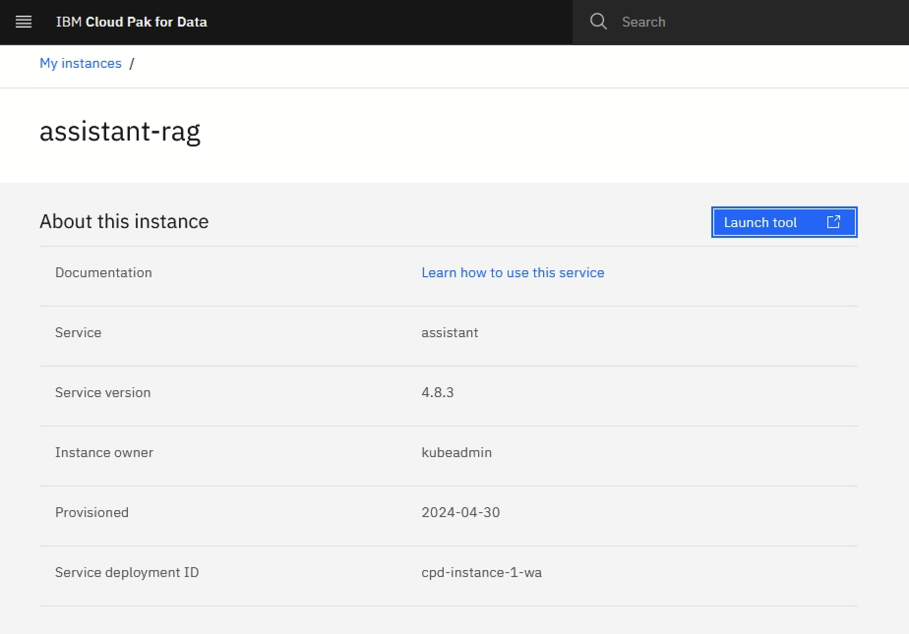

# Installing Retrieval Augmented Generation (RAG) application using watsonx.ai and watsonx.Discovery

This tutorial lists the steps to setup RAG with watsonx.ai, watsonx Discovery, and watsonx Assistant

## Prerequisites

1. An existing OpenShift cluster with file and block storage and the compute required for IBM Cloud Pak for Data and watsonx.ai.
2. A Linux VM with the following:
   1. oc CLI command
   2. cpd-cli CLI command

## Installation

### watsonx Discovery Installation

#### Deploy Elasticsearch

1. On your Linux VM, extract the watsonxDiscovery.zip file that contains three files: elastic.yaml, enterprise-search.yaml, and kibana.yaml.

   ```shell
   unzip watsonxDiscovery.zip
   ```

2. Create the Elasticsearch CRDs

   ```shell
   oc apply -f https://download.elastic.co/downloads/eck/2.11.1/crds.yaml
   ```

3. Create the Elasticsearch operator

   ```shell
   oc apply -f https://download.elastic.co/downloads/eck/2.11.1/operator.yaml
   ```

4. Create the Elasticsearch project

   ```shell
   oc new-project elastic
   ```

5. Create an instance of Elasticsearch

   ```shell
   oc apply -f elastic.yaml
   ```

   IMPORTANT: The elastic-search image/container requires a minimum of 8Gi of memory to function properly, and this may not be applied by default. Use the provided elastic.yaml file to set the containers memory limits to the 8Gi minimum requirement.

6. Validate successful creation of the Elastic Search Instance

   ```shell
   oc get pods -l common.k8s.elastic.co/type=elasticsearch -n elastic -w
   ```

   Wait about one minute for the pod labeled "common.k8s.elastic.co/type=elasticsearch" to enter a ready and running state.

#### Deploy Enterprise Search

1. Create an instance of Enterprise Search

   ```shell
   oc apply -f enterprise-search.yaml
   ```

2. Validate successful creation of the Enterprise Search Instance

   ```shell
   oc get pods -l common.k8s.elastic.co/type=enterprise-search -n elastic -w
   ```

   Wait about three minutes for the pod labeled "common.k8s.elastic.co/type=enterprise-search" to enter a ready and running state.

#### Deploy Enterprise Search

1. Create an instance of Enterprise Search

   ```shell
   oc apply -f enterprise-search.yaml
   ```

2. Validate successful creation of the Enterprise Search Instance

   ```shell
   oc get pods -l common.k8s.elastic.co/type=enterprise-search -n elastic -w
   ```

   Wait about three minutes for the pod labeled "common.k8s.elastic.co/type=enterprise-search" to enter a ready and running state.

#### Deploy Kibana

1. Create an instance of Kibana UI

   ```shell
   oc apply -f kibana.yaml
   ```

2. Validate successful creation of the Kibana UI Instance

   ```shell
   oc get pods -l common.k8s.elastic.co/type=kibana -n elastic -w
   ```

   Wait about one minute for the pod labeled "common.k8s.elastic.co/type=kibana" to enter a ready and running state.

#### Access the Kibana UI

1. Retrieve the generated admin password

   ```shell
   oc get secret elastic-search-es-elastic-user -n elastic -o jsonpath="{.data.elastic}" | \
    base64 --decode
   ```

2. Retrieve the Kibana route from OpenShift

   ```shell
   oc get route kibana -n elastic
   ```

3. Login to Kibana UI

#### Apply the Elasticsearch Trial License

1. Open the following URL to access the Dev Tools application

   ```shell
   https://<elasticsearch-route>/app/dev_tools#/console
   ```

2. Run the following API's to check the license status and activate the 30-day trial license:

   ```shell
   GET /_license/trial_status
   
   GET /_license
   
   POST /_license/start_trial?acknowledge=true
   
    Verify output (GET /_license)
   
   {
     "license": 
     {
       "status": "active",
       "uid": "a4e797e5-c4f5-4365-72-c9b7c82aad9c",
       "type": "trial",
       "issue_date": "2024-03-11T14:42:54.477Z",
       "issue_date_in_millis": 1710168174477,
       "expiry_date": "2024-04-10T14:42:54.477Z",
       "expiry_date_in_millis": 1712760174477,
       "max_nodes": 1000,
       "max_resource_units": null,
       "issued_to": "elastic-search",
       "issuer": "elasticsearch",
       "start_date_in_millis": -1
     }
   }
   ```

#### Deploy the .elser_model_2 ML Model

1. Go to Machine Learning->Trained Models and download the .elser_model_2 in the Elasticsearch UI

2. Start the deployment of the model

   

### watsonx Assistant Installation

1. Set up Multicloud Object Gateway.

   ```shell
   ./cpd-cli manage setup-mcg --components=watson_assistant \
      --cpd_instance_ns=${PROJECT_CPD_INST_OPERANDS} \
      --noobaa_account_secret=noobaa-admin \
      --noobaa_cert_secret=noobaa-s3-serving-cert
   ```

2. Install serverless knative eventing

   ```shell
   ./cpd-cli manage deploy-knative-eventing --release=${VERSION} \
      --block_storage_class=${STG_CLASS_BLOCK}
   ```

3. Apply OLM

   ```shell
   ./cpd-cli manage apply-olm --release=${VERSION} \
      --cpd_operator_ns=${PROJECT_CPD_INST_OPERATORS} \
      --components=watson_assistant
   ```

4. Apply custom resources

   ```shell
   ./cpd-cli manage apply-cr --components=watson_assistant \
      --release=${VERSION} \
      --cpd_instance_ns=${PROJECT_CPD_INST_OPERANDS} \
      --block_storage_class=${STG_CLASS_BLOCK} \
      --file_storage_class=${STG_CLASS_FILE} \
      --license_acceptance=true
   ```

### RAG LLM Application Setup

1. On your Linux VM, extract the ragllmservice.zip file.

   ```shell
   unzip ragllmservice.zip
   ```

2. Update the .env file with the required environment properties.

3. Create a new project

   ```shell
   oc new-project rag
   ```

4. Build the application

   ```shell
   oc new-build --strategy docker --binary --name=rag
   ```

5. Start the build

   ```shell
   oc start-build watsonx-discovey-rag  --from-dir=.
   ```

6. Deploy the application

   ```shell
   oc new-app rag --name=rag
   ```

7. Expose a Secure URL for this FastAPI app

   ```shell
   oc create route edge --service=rag
   ```

8. Verify the FastAPI docs link

   ```shell
   <url>/docs will take you to the swagger UI
   ```

9. POST /ingestDocs to ingest all the documents that have been uploaded to the S3 bucket

   ```json
   {
     "bucket_name": "string",
     "es_index_name": "string",
     "es_pipeline_name": "string",
     "chunk_size": "512",
     "chunk_overlap": "256",
     "es_model_name": ".elser_model_1",
     "es_model_text_field": "text_field",
     "es_index_text_field": "body_content_field",
     "metadata_fields": [ "string" ]
   }
   ```

10. POST /queryLLM to test connectivity

   ```json
   {
     "llm_instructions": "",
     "question": "show benefits of running sql server on vsan esa",
     "es_index_name": "vmwdocs-index",
     "es_index_text_field": "body_content_field",
     "es_model_name": ".elser_model_2",
     "num_results": "3",
     "llm_params": {
       "model_id": "meta-llama/llama-2-13b-chat",
       "inputs": [],
       "parameters": {
         "decoding_method": "greedy",
         "max_new_tokens": 500,
         "min_new_tokens": 1,
         "moderations": {
           "hap_input": "true",
           "hap_output": "true",
           "threshold": 0.75
         }
       }
     }
   }
   ```

### watsonx Assistant Configuration

1. Log into IBM Cloud Pak for Data, select ***Instances->New Instance->watsonx Assistant->New Instance->Create*** to create a service instance of watsonx Assistant.

   

2. Select ***Launch tool***

   

3. Provide an assistant name and select ***Create Assistant***

   

4. Select ***Integration*** from the left pane.

   

5. Select ***Build custom extension*** from the left pane.

   

6. Select ***Next*** on the *Get Started* page, enter an extension name on the *Basic information* page.

   

7. Drag and drop or upload ***openapi.json*** on the *Import OpenAPI* page and select ***Next***.

   

8. Review the extension details, select ***FINISH***.

   

9. Add the newly imported custom extension to the catalog by selecting ***ADD***.

   

10. Select ***Next*** on the *Get Started* page.

   

11. Fill in the *Server variables* field with the host name of the FastAPI app, then select ***Next***.

   

12. Review the custom extension operations and select ***FINISH***.

   

13. Select ***Actions*** from the left pane.

   

14. Select ***Create Action***.

   

15. Define actions...

16. Preview and test...


