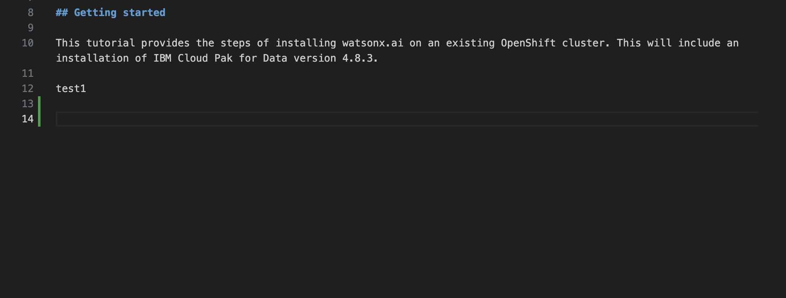

# Intro

## Getting started

This tutorial provides the steps of installing watsonx.ai on an existing OpenShift cluster. This will include an installation of IBM Cloud Pak for Data version 4.8.3.

test1

